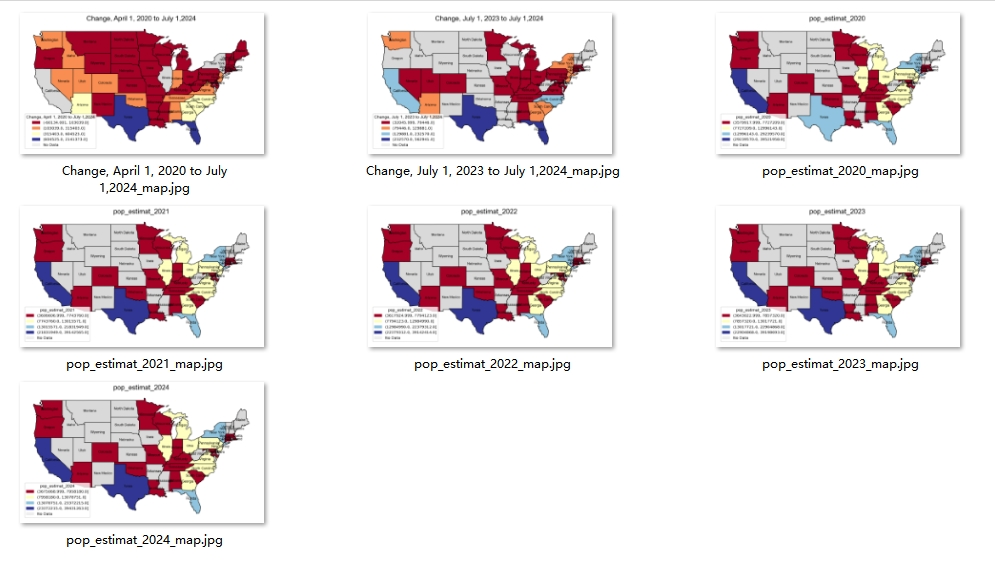
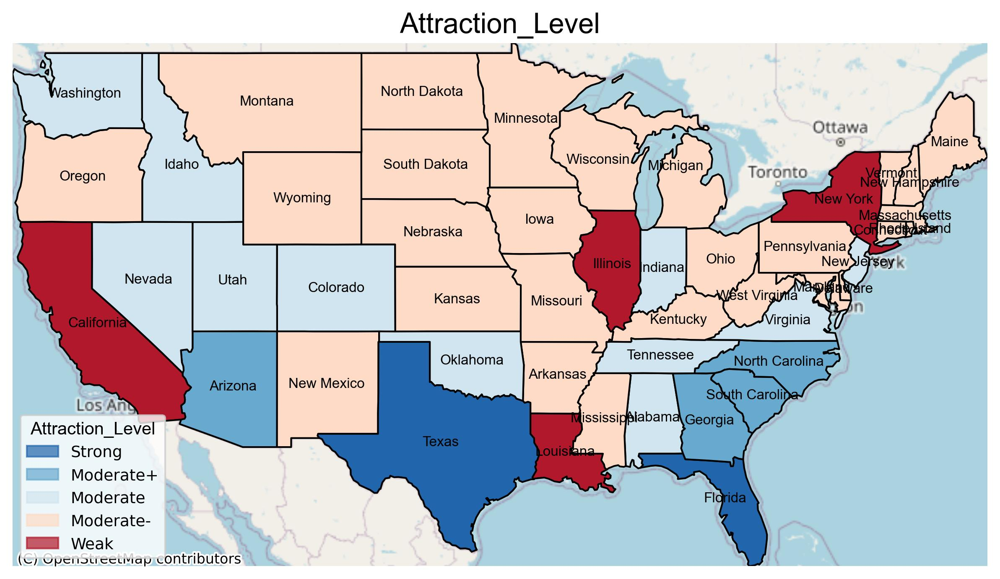

---

# batch-map-plotter

**batch-map-plotter** is a powerful and flexible Python tool designed for **batch plotting** of thematic maps, mainly using GeoPandas and Matplotlib.

It supports both **numeric** and **categorical** variables, **automatic binning**, **customized color maps**, **text labeling**, and **base map integration** — with full support for both **point** and **polygon geometries**. Ideal for data analysts, geospatial researchers, and anyone seeking a production-ready geographic visualization workflow.

---


---

## 🚀 Key Features Summary

* **Batch plotting multiple variables:** Plot several numeric or categorical variables at once, saving time and effort.
* **Flexible grouping:** Automatically split maps by categorical groups (e.g., regions), supporting both global and group-wise binning.
* **Smart binning strategies:** Support for natural breaks, quantiles, equal intervals, with automatic bin edge calculation.
* **Full color control:** Custom color palettes with optional reversing of colormap and legend order, alpha transparency adjustment.
* **Support for mixed data types:** Automatic detection or manual setting of variable type (numeric, categorical, mixed).
* **Labeling with overlap avoidance:** Place text labels with configurable minimum spacing to avoid clutter.
* **Geometry type adaptable:** Handles both polygon and point GeoDataFrames.
* **Basemap integration:** Add background tiles via contextily for richer geographic context.
* **High quality output:** Configurable figure size, resolution, and file saving.
* **Return updated GeoDataFrame:** Optionally get back the data with added binning columns for further analysis.

---

## 🛠 Detailed Parameters and Options

| Parameter                | Type            | Default            | Description                                                                                         |
| ------------------------ | --------------- | ------------------ | --------------------------------------------------------------------------------------------------- |
| **gdf**                  | GeoDataFrame    | —                  | Input GeoDataFrame containing geometry and attribute data.                                          |
| **vars**                 | list of str     | —                  | List of variable names (columns in gdf) to plot maps for.                                           |
| **var\_config**          | dict            | None               | Dict specifying per-variable config: type (`'numeric'`/`'categorical'`), bins, palette, order, etc. |
| **group\_by**            | str             | None               | Column name to group data for separate map outputs (e.g., region, category).                        |
| **bin\_by\_group**       | bool            | True               | Whether to bin numeric variables separately per group or use global binning across groups.          |
| **data\_type**           | str             | `'mixed'`          | Default variable type if not specified: `'numeric'`, `'categorical'`, or `'mixed'`.                 |
| **geometry\_type**       | str             | `'polygon'`        | Geometry type of data, `'polygon'` or `'point'`.                                                    |
| **point\_size**          | int             | 30                 | Marker size when plotting points.                                                                   |
| **basemap**              | contextily tile | None               | Basemap tile provider, e.g. `contextily.providers.CartoDB.Positron`.   高德底图：`contextily.providers.Gaode.Normal `  OpenStreetMap/OSM: `contextily.providers.OpenStreetMap.Mapnik`                           |
| **layer\_alpha**         | float (0–1)     | 1.0                | Alpha transparency for the geometry fill layer.                                                     |
| **bins**                 | int             | 5                  | Number of bins for numeric variable binning.                                                        |
| **binning\_strategy**    | str             | `'natural_breaks'` | Binning method: `'natural_breaks'`, `'quantiles'`, or `'equal_interval'`.                           |
| **palette**              | str or list     | `'RdYlBu'`         | Colormap name or list of colors for filling polygons or points.                                     |
| **reverse\_colormap**    | bool            | False              | Reverse the order of colors in the colormap.                                                        |
| **reverse\_legend**      | bool            | False              | Reverse the order of items in the map legend.                                                       |
| **alpha**                | float (0–1)     | 0.7                | Transparency of fill colors.                                                                        |
| **show\_labels**         | bool            | True               | Whether to draw text labels on the map.                                                             |
| **label\_col**           | str             | `'name'`           | Column used for label text.                                                                         |
| **label\_min\_dist**     | int             | 3000               | Minimum spacing (in meters) between labels to avoid overlap.                                        |
| **label\_fontsize**      | int             | 8                  | Font size of the labels.                                                                            |
| **fontfamily**           | str             | `'Arial'`          | Font family used for labels, title, and legend. 中文仿宋： `'FangSong'`                                                    |
| **output\_dir**          | str             | `'.'`              | Directory path to save output map images.                                                           |
| **dpi**                  | int             | 300                | Resolution (dots per inch) for saved images.                                                        |
| **figsize**              | tuple(int,int)  | (10, 10)           | Size of the output figure in inches (width, height).                                                |
| **return\_updated\_gdf** | bool            | False              | Return the GeoDataFrame with added binning columns after plotting.                                  |

---

## 🔧 Function Overview

```python
def plot_batch_maps(
    gdf,
    vars,

    # === Variable Configuration ===
    var_config=None,
    group_by=None,
    bin_by_group=True,

    # === Geometry Settings ===
    data_type='mixed',
    geometry_type='polygon',
    point_size=30,
    basemap=None,
    layer_alpha=0.5,

    # === Binning & Colors ===
    bins=5,
    binning_strategy='natural_breaks',
    palette='RdYlBu',
    reverse_colormap=False,
    reverse_legend=False,
    alpha=0.7,

    # === Labeling Options ===
    show_labels=True,
    label_col='name',
    label_min_dist=3000,
    label_fontsize=8,
    fontfamily='Arial',

    # === Output Settings ===
    output_dir='.',
    dpi=300,
    figsize=(10, 10),
    return_updated_gdf=False
)
```

---

## 📦 Installation

```bash
pip install batch-map-plotter
```

---

## 🌍 Example Dataset

We use the official U.S. state population projections (2020–2024) combined with geographic boundaries to demonstrate plotting features. Sample file: `assets/US_population_plot.geojson`

```markdown
|    | id   | name       | state      |   pop_estimat_2020 |   pop_estimat_2021 |   pop_estimat_2022 |   pop_estimat_2023 |   pop_estimat_2024 |   Change, July 1, 2023 to July 1,2024 |   Change, April 1, 2020 to July 1,2024 | region   | Attraction_Level   |
|---:|:-----|:-----------|:-----------|-------------------:|-------------------:|-------------------:|-------------------:|-------------------:|--------------------------------------:|---------------------------------------:|:---------|:-------------------|
|  0 | AL   | Alabama    | Alabama    |            5033094 |            5049196 |            5076181 |            5117673 |            5157699 |                                 40026 |                                 132330 | South    | Moderate           |
|  2 | AZ   | Arizona    | Arizona    |            7187135 |            7274078 |            7377566 |            7473027 |            7582384 |                                109357 |                                 424274 | West     | Moderate+          |
|  3 | AR   | Arkansas   | Arkansas   |            3014546 |            3026870 |            3047704 |            3069463 |            3088354 |                                 18891 |                                  76801 | South    | Moderate-          |
|  4 | CA   | California | California |           39521958 |           39142565 |           39142414 |           39198693 |           39431263 |                                232570 |                                -124411 | West     | Weak               |
|  5 | CO   | Colorado   | Colorado   |            5787129 |            5814036 |            5850935 |            5901339 |            5957493 |                                 56154 |                                 182169 | West     | Moderate           |
```

## 🧪 Usage Examples

### 1. Basic: Plot multiple numeric variables

```python

#read file:
import geopandas as gpd
from batch_map_plotter import plot_batch_maps

US_pop = gpd.read_file('assets/US_population_plot.geojson')


plot_batch_maps(
    gdf=US_pop,
    vars=['pop_estimat_2020', 'pop_estimat_2021',
       'pop_estimat_2022', 'pop_estimat_2023', 'pop_estimat_2024',
       'Change, July 1, 2023 to July 1,2024',
       'Change, April 1, 2020 to July 1,2024'],

    bins=5,
    binning_strategy='natural_breaks',
    palette='RdYlBu',

    show_labels=True,
    label_col='name',

    dpi=300,
    figsize=(10, 10),
    return_updated_gdf=False,

    output_dir="."
)
```



### 2. Grouped Maps with Basemap ( !! group-wise binning by default !! )

```python
import contextily

plot_batch_maps(
    gdf=US_pop,
    vars=["pop_estimat_2024", 'Change, July 1, 2023 to July 1,2024'],
    group_by="region",
    basemap=contextily.providers.CartoDB.Positron,
    output_dir="."
)
```


### 3. Custom Config Example

```python
var_config = {
    "Attraction_Level": {
        "type": "categorical",
        "order": ["Strong", "Moderate+", "Moderate", "Moderate-", "Weak"],
        "order_by": "good_to_bad",
        "palette": ["#2166ac", "#67a9cf", "#d1e5f0", "#fddbc7", "#b2182b"]
    },
    "pop_estimat_2024": {
        "type": "numeric",
        "bins": 10,
        "strategy": "natural_breaks",
        "palette": "YlGnBu"
    }
}

plot_batch_maps(
    gdf=US_pop,
    vars=["Attraction_Level", "pop_estimat_2024"],
    var_config=var_config,
    basemap=contextily.providers.OpenStreetMap.Mapnik,
    label_col="name",
    reverse_legend=False,
    output_dir="."
)
```


 **population attraction level by state:** 




---

## 📜 License

MIT License

---

---

